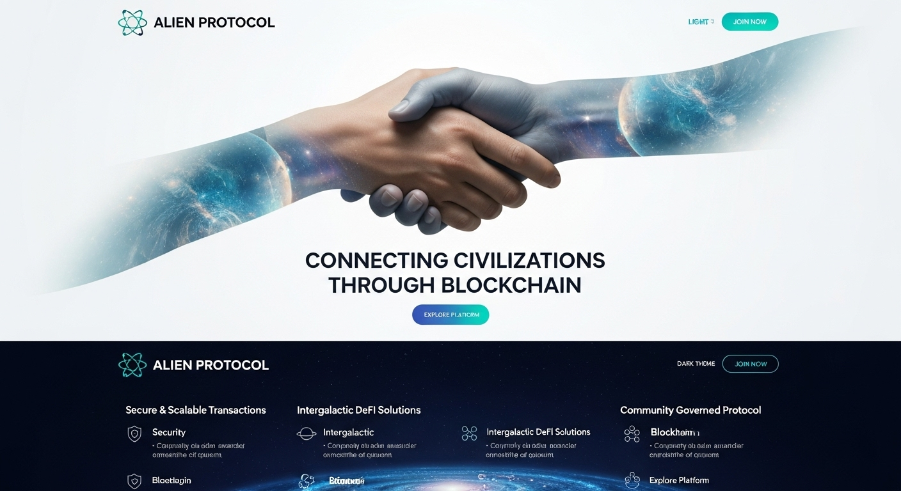

# 🚀 Alien Protocol - Intergalactic Web3 Platform

Welcome to **Alien Protocol**, the revolutionary Web3 platform that connects cosmic explorers across the universe! Join our intergalactic community of pioneers, developers, and visionaries who believe in the future of decentralized finance.



## 🌌 About Alien Protocol

Alien Protocol is more than just a Web3 platform - it's a cosmic movement that brings together the brightest minds from across the galaxy to build the future of decentralized finance. Our mission is to create an intergalactic ecosystem where innovation meets community.

## ✨ Features

### 🎯 **Core Platform**

- **Cosmic Trading Tools** - Advanced DeFi trading instruments
- **Universal Wallet Integration** - Seamless cross-chain compatibility
- **Intergalactic Community** - Connect with Web3 pioneers worldwide
- **Alien Token Ecosystem** - Earn and trade our native tokens

### 🚀 **Viral Marketing System**

- **100 Alien Tokens** for social media reposts
- **Multi-platform sharing** (Twitter, LinkedIn, Facebook, Instagram, TikTok, YouTube, Reddit, Discord)
- **Instant token rewards** to your wallet
- **Unlimited earning potential**

### 🤝 **Partnership Program**

- **5% of all issued tokens** for founding partners
- **Full governance rights** in Alien Protocol Team
- **Revenue sharing** from ecosystem growth
- **Co-ownership** of intergalactic infrastructure

## 🛠️ Tech Stack

- **Framework:** [Next.js 14](https://nextjs.org/)
- **Styling:** [Tailwind CSS](https://tailwindcss.com/)
- **UI Components:** [Shadcn/ui](https://ui.shadcn.com/)
- **Icons:** [Lucide React](https://lucide.dev/)
- **TypeScript:** Full type safety
- **Email:** Nodemailer with Gmail SMTP

## 🚀 Quick Start

### Prerequisites

- Node.js 18+
- npm or yarn
- Gmail App Password (for contact form)

### Installation

1. **Clone the repository:**

```bash
git clone https://github.com/RomanDevelop/Alien-Protocol-Website.git
cd Alien-Protocol-Website
```

2. **Install dependencies:**

```bash
npm install
```

3. **Set up environment variables:**

```bash
cp .env.example .env.local
```

Edit `.env.local` with your Gmail credentials:

```env
EMAIL_USER=your-email@gmail.com
EMAIL_PASS=your-16-character-app-password
```

4. **Run the development server:**

```bash
npm run dev
```

5. **Open your browser:**
   Navigate to [http://localhost:3000](http://localhost:3000)

## 📧 Email Setup

The contact form requires Gmail App Password setup. See [EMAIL_SETUP.md](./EMAIL_SETUP.md) for detailed instructions.

## 🌟 Sections

- [x] **Hero** - Cosmic landing with neon buttons
- [x] **Features** - Platform capabilities showcase
- [x] **Benefits** - Why choose Alien Protocol
- [x] **Pricing** - Token earning and partnership tiers
- [x] **Team** - Meet our cosmic crew
- [x] **Testimonials** - Community feedback
- [x] **FAQ** - Frequently asked questions
- [x] **Contact** - Get in touch with our team
- [x] **Footer** - Links and information

## 🎨 Design Features

- **Fully Responsive** - Works on all devices
- **Dark/Light Mode** - Theme switching
- **Neon Effects** - Glowing buttons and animations
- **Cosmic Theme** - Space-inspired design
- **Smooth Animations** - Enhanced user experience

## 🤝 Contributing

We welcome contributions from cosmic explorers! Please read our contributing guidelines and join our community:

- **Discord:** [Join our server](https://discord.gg/alien-protocol)
- **Telegram:** [@AlienTokenWorkspace](https://t.me/AlienTokenWorkspace)
- **GitHub:** [Report issues](https://github.com/RomanDevelop/Alien-Protocol-Website/issues)

## 📱 Community

- **Website:** [Alien Protocol](https://alien-5cef4.web.app)
- **Telegram:** [@AlienTokenWorkspace](https://t.me/AlienTokenWorkspace)
- **Twitter:** [@alien_protocol](https://x.com/alien_protocol)
- **LinkedIn:** [Alien Protocol](https://www.linkedin.com/company/seamens-club-ai-hub/?viewAsMember=true)
- **Discord:** [Join our server](https://discord.gg/alien-protocol)

## 📄 License

This project is licensed under the MIT License - see the [LICENSE](./LICENSE) file for details.

## 🌟 Acknowledgments

- Built with ❤️ for the cosmos
- Inspired by the Shadcn/ui design system
- Powered by the Next.js framework
- Styled with Tailwind CSS

---

**Ready to explore the Cosmic Universe?** 🚀

Join our intergalactic community and start your journey into the future of Web3!

_Built with ❤️ for the cosmos_ ✨
# Alien-Protocol
